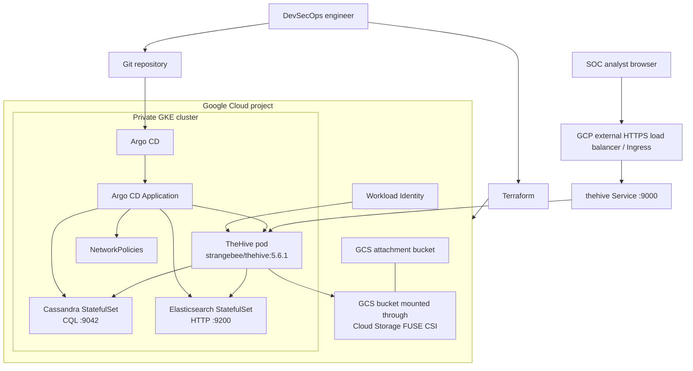

# TheHive SOAR on GCP with Terraform, GKE, Argo CD, and Kubernetes

This repository deploys TheHive 5 on Google Cloud using:

- The official StrangeBee Docker image: `strangebee/thehive:5.6.1`
- Terraform for Google Cloud project, network, GKE, and storage provisioning
- Kubernetes manifests managed by Argo CD
- Apache Cassandra for TheHive data
- Elasticsearch for indexing
- Google Cloud Storage mounted with Cloud Storage FUSE CSI for file attachments

The design is production-shaped, with namespaces, resource requests, network policies, health checks, pod disruption budgets, private nodes, Workload Identity, and GitOps deployment. The default sizing is intentionally small because you said you are using the GCP free tier.

Important cost note: a real production TheHive deployment is not free-tier sized. StrangeBee documents materially higher CPU and memory requirements for production workloads, and GKE, load balancers, disks, NAT, logs, and egress can create billable charges. Treat this repo as a secure starter environment and scale it after validating budget and licensing.

## Official References

- StrangeBee Docker image: <https://hub.docker.com/r/strangebee/thehive>
- TheHive Docker documentation: <https://docs.strangebee.com/thehive/installation/docker/>
- TheHive Kubernetes documentation: <https://docs.strangebee.com/thehive/installation/kubernetes/>
- TheHive software requirements: <https://docs.strangebee.com/thehive/installation/software-requirements/>

## System Architecture



## Repository Layout

```text
.
├── README.md
├── argocd
│   ├── applications
│   │   └── thehive.yaml
│   └── projects
│       └── security-platform.yaml
├── docs
│   ├── OPERATIONS.md
│   └── SECURITY.md
├── k8s
│   ├── base
│   │   ├── cassandra
│   │   ├── elasticsearch
│   │   ├── thehive
│   │   └── kustomization.yaml
│   └── overlays
│       └── gcp-free-tier
│           ├── kustomization.yaml
│           ├── patches
│           └── secrets
└── terraform
    ├── backend.tf.example
    ├── gke.tf
    ├── iam.tf
    ├── locals.tf
    ├── outputs.tf
    ├── project.tf
    ├── providers.tf
    ├── storage.tf
    ├── terraform.tfvars.example
    ├── variables.tf
    ├── versions.tf
    └── vpc.tf
```

## Target Deployment

The default deployment creates:

- One GCP project under organization `356024295871`
- One regional VPC and subnet
- One private, zonal GKE cluster with a small node pool
- Workload Identity binding for the TheHive Kubernetes service account
- One GCS bucket for TheHive attachments
- Argo CD installed into the cluster
- One Argo CD Application that syncs `k8s/overlays/gcp-free-tier`
- Cassandra, Elasticsearch, and TheHive in the `thehive` namespace

## Prerequisites

Install these locally:

- Google Cloud CLI
- Terraform 1.6+
- kubectl
- argocd CLI, optional but useful
- git

You also need:

- Permission to create projects under organization `356024295871`
- A billing account ID
- A Git repository URL that Argo CD can read

Authenticate:

```powershell
gcloud auth login
gcloud auth application-default login
```

Find your billing account:

```powershell
gcloud billing accounts list
```

## Step 1: Configure Terraform

Copy the example variables file:

```powershell
Copy-Item terraform\terraform.tfvars.example terraform\terraform.tfvars
```

Edit `terraform/terraform.tfvars`:

```hcl
org_id          = "356024295871"
billing_account = "000000-000000-000000"
project_id      = "thehive-soar-lab-12345"
project_name    = "thehive-soar-lab"
region          = "us-central1"
zone            = "us-central1-a"
```

The `project_id` must be globally unique.

## Step 2: Create GCP Infrastructure

```powershell
Set-Location terraform
terraform init
terraform plan
terraform apply
```

Terraform will output commands for connecting to GKE.

## Step 3: Connect kubectl to the Cluster

```powershell
gcloud container clusters get-credentials thehive-gke --zone us-central1-a --project YOUR_PROJECT_ID
```

Confirm access:

```powershell
kubectl get nodes
```

## Step 4: Generate Kubernetes Secrets

The repo includes a placeholder file at `k8s/overlays/gcp-free-tier/secrets/thehive-secrets.example.yaml`. Do not commit real secrets.

Create a local secret manifest:

```powershell
Copy-Item k8s\overlays\gcp-free-tier\secrets\thehive-secrets.example.yaml k8s\overlays\gcp-free-tier\secrets\thehive-secrets.yaml
```

Replace every `CHANGE_ME` value with strong random values. For example:

```powershell
[Convert]::ToBase64String((1..64 | ForEach-Object { Get-Random -Maximum 256 }))
```

Apply the local secret before Argo CD syncs the application:

```powershell
kubectl apply -f k8s\overlays\gcp-free-tier\secrets\thehive-secrets.yaml
```

For production, use Google Secret Manager with External Secrets instead of committing or applying local Secret YAML.

## Step 5: Update GitOps Placeholders

Replace these placeholders before pushing:

- `REPLACE_WITH_PROJECT_ID` in `k8s/overlays/gcp-free-tier/patches/thehive-gcp-values.yaml`
- `REPLACE_WITH_THEHIVE_HOST_OR_IP` in `k8s/overlays/gcp-free-tier/patches/thehive-config-values.yaml`
- `https://github.com/YOUR_ORG/YOUR_REPO.git` in `argocd/projects/security-platform.yaml`
- `https://github.com/YOUR_ORG/YOUR_REPO.git` in `argocd/applications/thehive.yaml`

Use the Terraform `project_id` value for the project placeholder.

## Step 6: Push the Repository

Commit and push this repo to the Git URL you put in the Argo CD manifests. Argo CD needs to read that URL.

```powershell
git add .
git commit -m "Add TheHive GCP GitOps deployment"
git remote add origin https://github.com/YOUR_ORG/YOUR_REPO.git
git push -u origin main
```

## Step 7: Bootstrap Argo CD

Apply the Argo CD project and application:

```powershell
kubectl apply -f argocd/projects/security-platform.yaml
kubectl apply -f argocd/applications/thehive.yaml
```

Watch sync:

```powershell
kubectl -n argocd get applications
kubectl -n thehive get pods
```

## Step 8: Access TheHive

Get the external IP:

```powershell
kubectl -n thehive get ingress thehive
```

Open:

```text
http://EXTERNAL_IP/
```

For production, map a DNS name to this IP and add ManagedCertificate or cert-manager for HTTPS.

## What It Looks Like When Deployed

Expected Kubernetes objects:

```text
namespace/thehive
statefulset.apps/cassandra
statefulset.apps/elasticsearch
deployment.apps/thehive
service/cassandra
service/elasticsearch
service/thehive
ingress.networking.k8s.io/thehive
poddisruptionbudget.policy/thehive
networkpolicy.networking.k8s.io/*
```

Expected pods:

```text
cassandra-0        1/1 Running
elasticsearch-0    1/1 Running
thehive-...        1/1 Running
```

The browser shows the TheHive login screen served by the official StrangeBee image. After first login and license setup, SOC users can create organizations, users, alerts, cases, tasks, observables, dashboards, and integrations.

## Production Hardening Checklist

- Replace local Kubernetes Secrets with Google Secret Manager and External Secrets.
- Add HTTPS with a real DNS name and Google ManagedCertificate or cert-manager.
- Increase node count to at least three nodes.
- Use three Cassandra replicas and three Elasticsearch nodes for real HA.
- Configure Cassandra and Elasticsearch authentication and TLS.
- Enable backups for persistent disks and GCS bucket retention.
- Add Cloud Armor for the public endpoint.
- Add centralized logging and alerting.
- Restrict Argo CD access with SSO and RBAC.
- Pin image digests after validation.
- Run vulnerability scans against all dependency images.
- Validate TheHive license requirements for multi-node use.

## Upgrade Pattern

Update the TheHive image in `k8s/base/thehive/deployment.yaml`, then let Argo CD sync:

```yaml
image: strangebee/thehive:5.6.1
```

Read the StrangeBee upgrade notes before changing minor versions. Back up Cassandra, Elasticsearch, and attachment storage before upgrades.

## Destroy

Destroying removes the cluster and cloud resources. Back up anything important first.

```powershell
Set-Location terraform
terraform destroy
```
